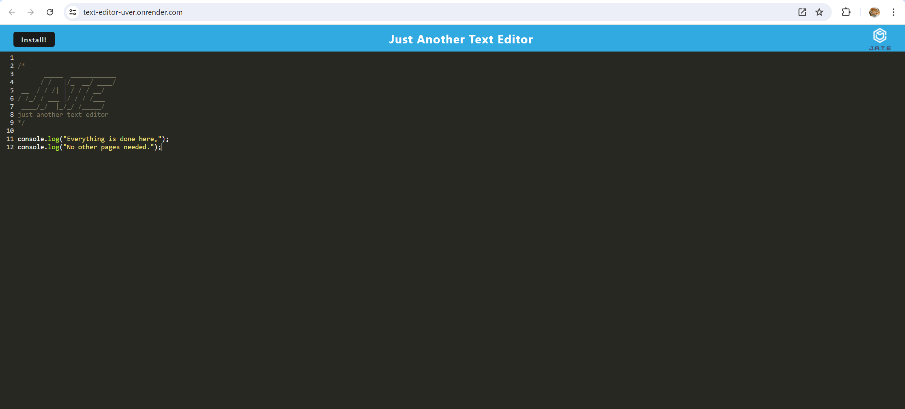
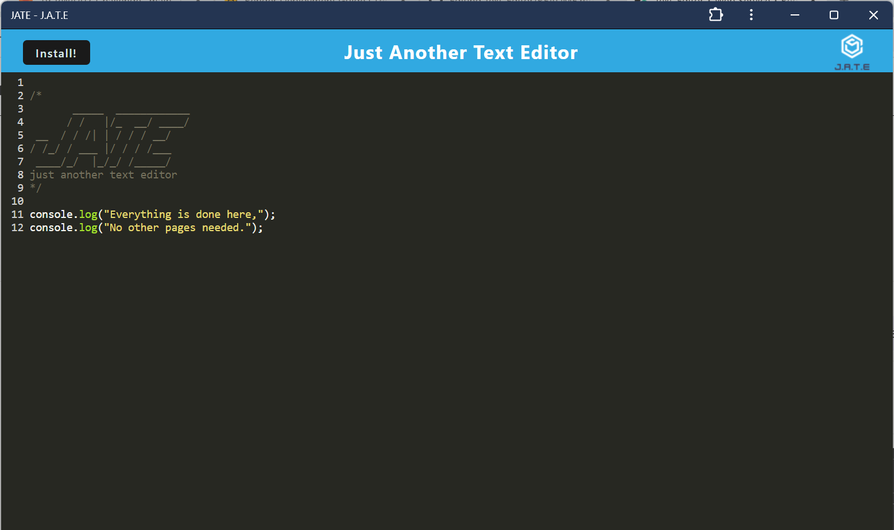

# Text-Editor

## Description

This text editor was mostly to figure out how and why assets, dist files, and manifesting works. It's one thing to learn about them, but replicating it in accordance to the project variables in another thing. This was also an easy intro to making our own progressive web applications.

## Installation

If the user is using this project as the files itself, they will have to start by typing 'npm run install' then 'npm run start:dev'. Otherwise, the project can be accessed via the following link:
[render link](https://text-editor-uver.onrender.com/)

## Usage

Everything starts and ends here. The only feature of this text editor is simply adding text. 

If you so choose to install the application, it will display the text put down in the website too. 

## License

https://choosealicense.com/licenses/mit/

MIT License

    Copyright (c) 2024 Paula 'Fel' Gonzalez
    
    Permission is hereby granted, free of charge, to any person obtaining a copy
    of this software and associated documentation files (the "Software"), to deal
    in the Software without restriction, including without limitation the rights
    to use, copy, modify, merge, publish, distribute, sublicense, and/or sell
    copies of the Software, and to permit persons to whom the Software is
    furnished to do so, subject to the following conditions:
    
    The above copyright notice and this permission notice shall be included in all
    copies or substantial portions of the Software.
    
    THE SOFTWARE IS PROVIDED "AS IS", WITHOUT WARRANTY OF ANY KIND, EXPRESS OR
    IMPLIED, INCLUDING BUT NOT LIMITED TO THE WARRANTIES OF MERCHANTABILITY,
    FITNESS FOR A PARTICULAR PURPOSE AND NONINFRINGEMENT. IN NO EVENT SHALL THE
    AUTHORS OR COPYRIGHT HOLDERS BE LIABLE FOR ANY CLAIM, DAMAGES OR OTHER
    LIABILITY, WHETHER IN AN ACTION OF CONTRACT, TORT OR OTHERWISE, ARISING FROM,
    OUT OF OR IN CONNECTION WITH THE SOFTWARE OR THE USE OR OTHER DEALINGS IN THE
    SOFTWARE.

## Questions

If you have any questions, please contact me through either:
My GitHub: https://github.com/gonz951

Or email: felgonzalez951@gmail.com
